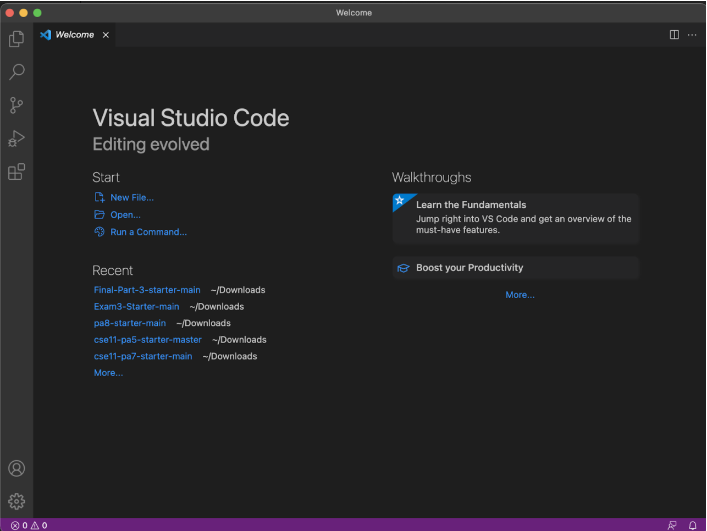
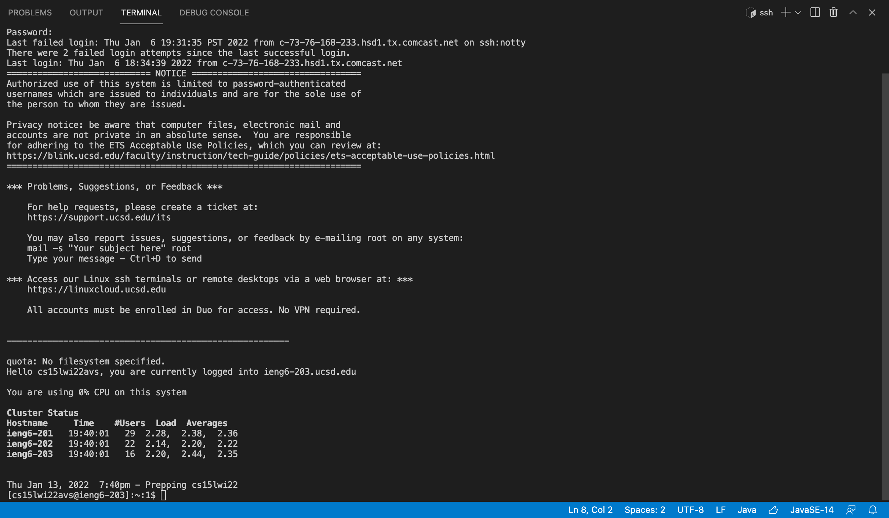
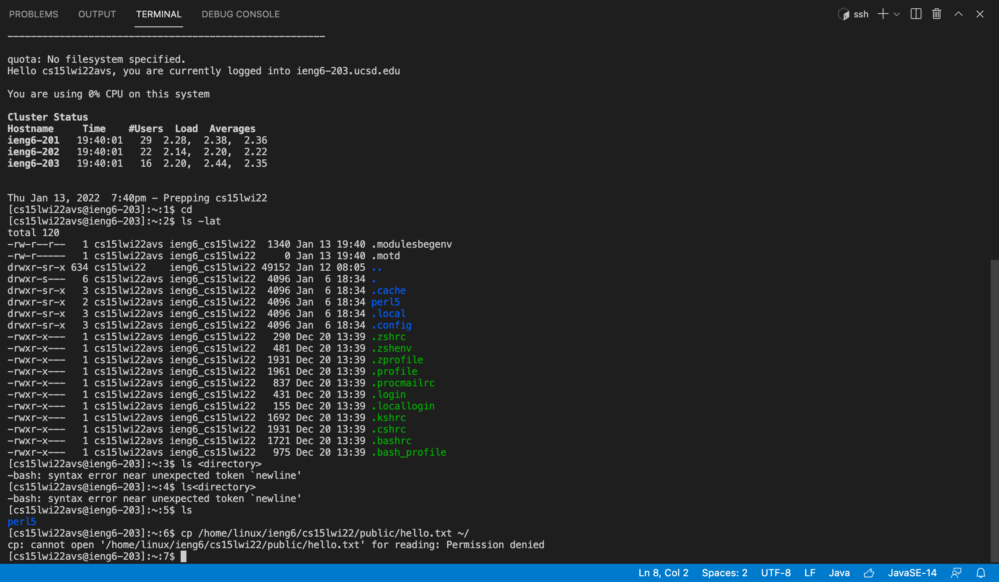
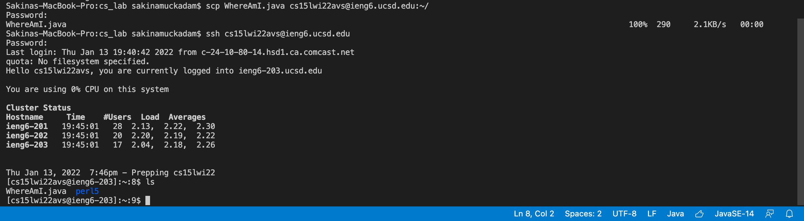
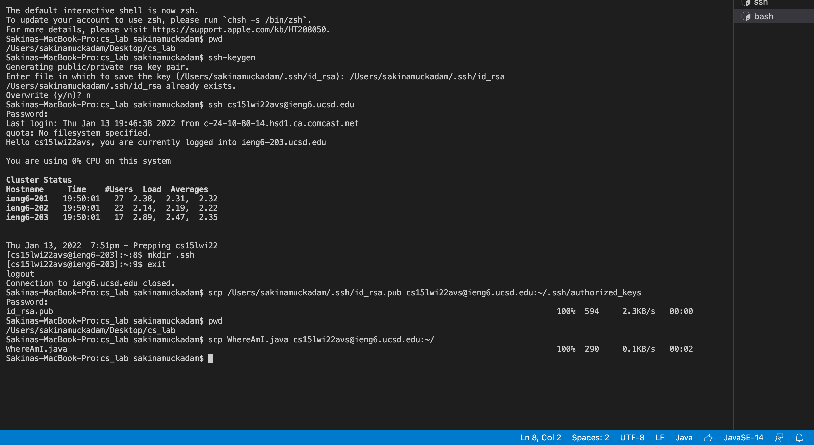
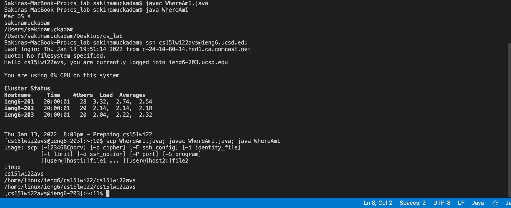

# Hello! Welcome to Lab 1 - Intro to SSH and SCP

## You will learn how to SSH and SCP into a remote server in just 6 easy steps!!! 

By Sakina Muckadam (CS Student at UCSD)

### Step 1: Set Up
- Download your development environment. I highly recommend Visual Studio Code. 

[Link to Virtual Studio Code (CLICK HERE)](https://code.visualstudio.com/)

### Step 2: Remote Connecting
- The next step is connecting to a remote computer. In this example I am going to connect to my remote computer in the UCSD Computer Lab.
- You are going to write the command
-  `ssh ("insert your account")`

   

- This is what your terminal should look like
- You can open up a terminal by clicking the plus button at the top.
- If this is your first time connecting then you will most likely get an authenticity message type in `yes` for that.

### Step 3: Let's Run Some Commands
- Lets try running some commands to see what happens

- `cd` takes you back to your home
- `ls -lat` lists the contents of the directory
- The last command is trying to take a copy of the file and put it in your directory but as we can see I don't have permission for that and so I was denied.
- Remember to `exit` to logout of the remote computer

### Step 4: Moving files with SCP

- SCP allows your to copy a file from your computer to the remote computer
- `scp (filename) (account) ~/`

- I scp'ed the file then logged into the remote computer using ssh to check the directory. When I typed in the command `ls` I can see at the bottom that the file I copied over (WhereAmI.java) is successfully there

### Step 5: SSH Keys

- Have you noticed that whenever you ssh or scp you have to put in your password. Well that takes up so much time and when doing this several it can get redundant and annoying. That why we create ssh keys so we don't have to keep on entering our password.
1. On your computer (the client) - type `ssh-keygen`
2. And you should get a key pair.
3. Follow the instructions listed in the terminal to get you your key
4. Then log in to your remote computer
5. Type in  `mkdir .ssh`
6. Then `exit` to logout
7. Lastly `scp` the path and your username

Once you finish, you should be able to log in without needing your password.

- As seen in the photo I already had a key made so I ran the command on my remote computer and then checked if I needed my password when I copied my file. I did not need my password so this step was SUCCESSFUL!!!

### Step 6: Making It Easier
- You can join commands into one line to make it easier and more pleasant when trying to copy and run a file.

- In the photo I first run the file on my client to see what it does, and then I run one line to ssh and one line to copy and run at the same time. This saves me time and is more pleasant to look at. 
- You can use semi-colons to run multiple commands in the same line. 

## And that is it, you have successfully learned how to ssh and scp with ease. Now go out and have fun with this new information!!!