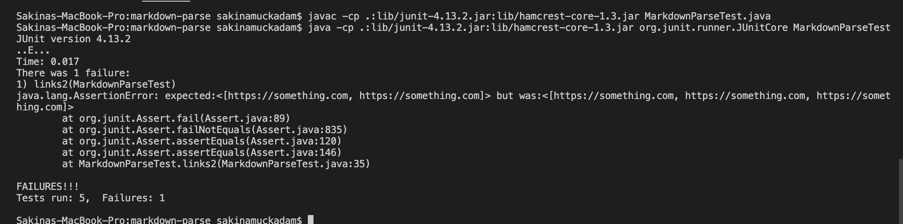
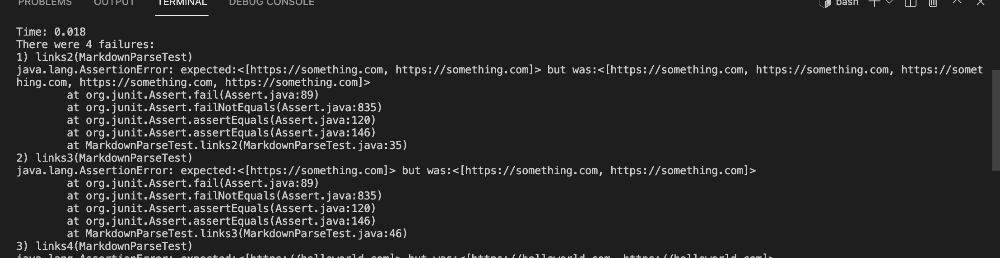
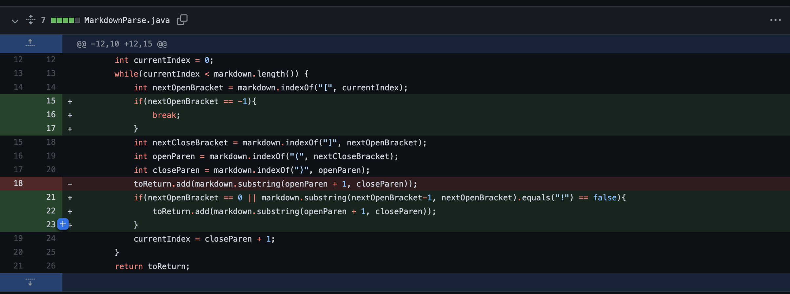
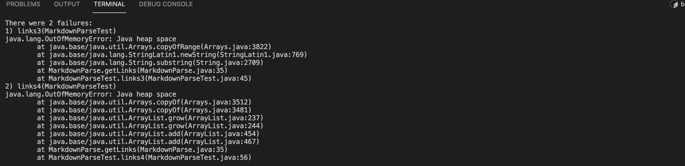
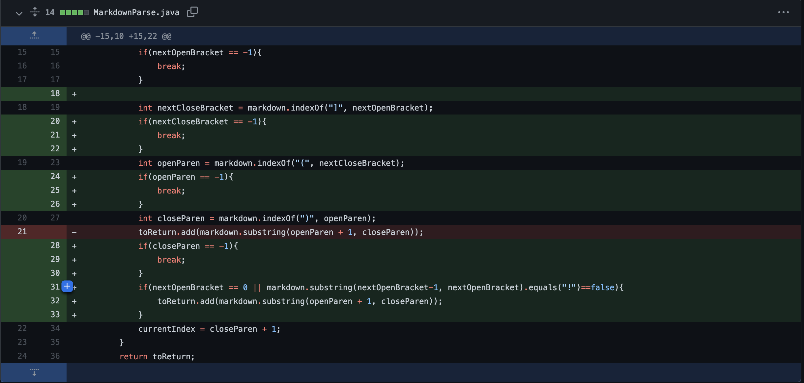

# Hello! Welcome to Lab 2 - JUnit Testing and Debugging

## We are going to be talking about JUnit Testing and how to find and debug an error. We will be learning some important vocab so be on the lookout.

By Sakina Muckadam (CS Student at UCSD)


---

This week my lab group and I worked on fixing three errors that popped up in our code when we were checking our inputs. 

We started off by trying to make sure our code would work for several inputs, while we were in this process, we came across three **failure - inducing inputs.** 

### 1) First Bug: Alternative Link

The first thing we thought about was the format of what a link lookd like.

```[alternative text](link.com)```

This is the code for a link so we though about what could look similar immediately we thought about immages. 

``````

The only difference here is the `!` in the beginning. Therefore we realized when we tested our file with an image we also got the image in our results. When we did not want an image. This was our failure-induced input. 

Here is a link to the file that caused the failure-inducing input:

[Link to test-file2.md](test-file2.md)

The sympton of this failure-inducing input was that we got the image link when we only wanted the normal link. 




As we can see in this photo we expected just two files but got three, one of those (in the middle) was the image file. This is not something we wanted to print. Our symptom is that we are printing something we did not intend to. Our bug comes from not handling the `!` in front of the image well.

Now to fix this bug we decided to add an if-statement that would help us rule out the `!` in the image links.


As we can see line 21-23 helps us fix the bug. 

We saw that putting an image link was a failure-inducing input, therefore our symptom of that input was something different from what we expected. We expected just one link and instead got two, therefore to fix the bug we added an if-statement to rule out all weird links that we could have.

### 2) Second Bug: Printing Extras

The second thing we noticed was that we were printing extra links. Out failure-inducing input was when we wanted to print multiple links, and our symptom was that we were getting one too many links. This symptom showed up when we inputed the if-statement for the images. 

[Link to test-file4.md](test-file4.md)

Here is the symptom of our failure-inducing input:



As we can see we have one too many links as our actual, which is our symptom, something we did not want. 

To fix this symptom we figured out that our bug was that we had to figure out our bug in our code. We realized we had a indexing error. To fix this bug we had to delete one line after our if-statement. 



Our failure-inducing input was multiple links, where our symptom was one too many links. Tp fix this symptom we looked at our code where we found a bug about the indexing. To fix this but we had to delete one line, specifically line 18. 


### 3) Third Bug: Special Cases

We also realized that by playing around with the paranthesis and brackets there were many places where things could go wrong. We found that one of our failure-inducing inputs was
` ()[] `. Just empty paranthesis which returned a memory error.

Here is the link to the failure-inducing input file:

[link to test-file3.md](test-file3.md)

This failure-inducing input caused a symptom that was a java heap space error. Since we were in a while loop the while loop just keeps repeating and causes our code to bug out.



The bug with this symptom was that we were not checking for special paranthesis or brackets. Therefore we added in if statements to account for that bug.



In this third bug our failure-inducing input was a bunch of random paranthesis. Our symptom was a java heap space error that made our code freak out. The bug was because of not accounting for those which we fixed by placing if-statements.

---
And there you are folks another step closer to becoming pro-coders.
Don't worry if some of this was complicated believe me, I thought so too, but take a deep breath and think. You got this y'all. See you later. Happy Coding!!!