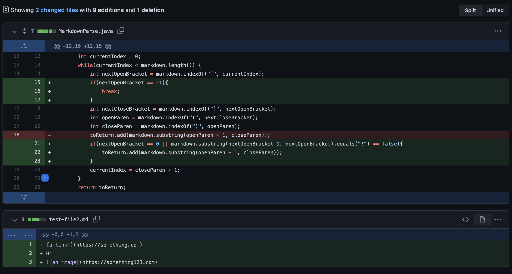

# Hello! Welcome to Lab 2 - JUnit Testing and Debugging

## We are going to be talking about JUnit Testing and how to find and debug an error. We will be learning some important vocab so be on the lookout.

By Sakina Muckadam (CS Student at UCSD)

---

This week my lab group and I worked on fixing three errors that popped up in our code when we were checking our inputs. 

We started off by trying to make sure our code would work for several inputs, while we were in this process, we came across three **failure - inducing inputs.** 

### First Bug: Alternative Links

The first thing we thought about was the format of what a linked looked like.

` [alternative text](link.com) `

This is the code for a link so we though about what could look similar immediately we thought about immages. 

` `

The only difference here is the `!` in the beginning. Therefore we realized when we tested our file with an image we also got the image in our results. When we did not want an image. This was our failure-induced input. 

Here is a link to the file that caused the failure-inducing input:

[Link to test-file2.md](test-file2.md)

The sympton of this failure-inducing input was that we got the image link when we only wanted the normal link. 

# NEED TO STILL ADD OUTPUT

Now to fix this bug we decided to add an if-statement that would help us rule out the `!` in the image links.

As we can see line 21-23 helps us fix the bug. 

We saw that putting an image link was a failure-inducing input, therefore our sympton of that input was something different from what we expected. We expected just one link and instead got two, therefore to fix the bug we added an if-statement to rule out all weird links that we could have.
