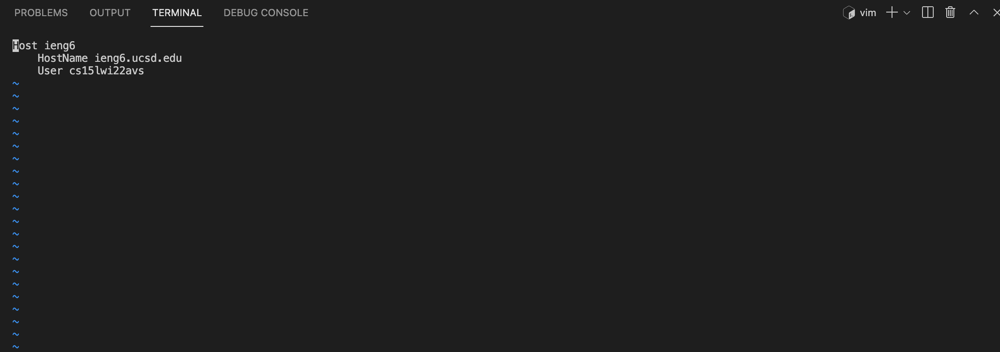
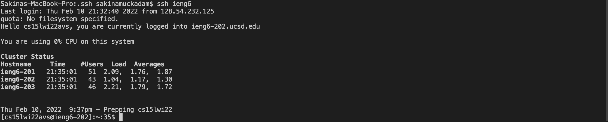
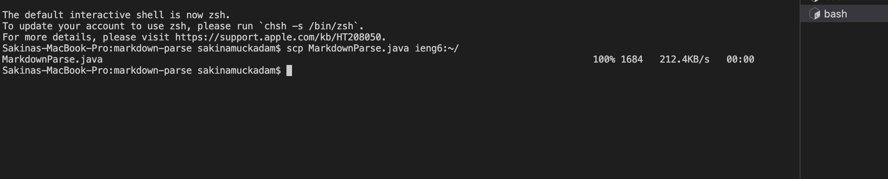

# Hello! Welcome to Lab 3 - Streamlining the ssh Configuration

## We are going to be talking about streamlining the ssh process and making it much easier to ssh quicker and much more efficiently

By Sakina Muckadam (CS Student at UCSD)

---

This week my lab group and I worked on trying to streamline our ssh processes and make it faster. 

### 1) First: Figure out how to change the settings

We started off with figuring out how to access the files to change our host name to ieng6.

To do this I changed directories from my main directory into `.ssh`

To do this I typed the command: `cd .ssh`

Then I typed in `vim config` to access the configuration file.

In the configuration file I typed in the information as shown in the picture below, and that helped my streamline my process. 



This changed my hostname to ieng6 so now when I want to access that account all I have to do is type in `ieng6` instead of my username. 

### 2) On to checking it out!!!

Now that I had streamlined the process I had to check it out. Just like with all coding I had to test it to make sure it ran properly. 

To do this I typed in `ssh ieng6` 

`ieng6` is my hostname so now whenever I want to ssh into my school server I just have to type in `ssh ieng6`, this is so much better than having to remember my whole username.



As we can see in the photo all I typed in was `ssh ieng6` and I was in my account ready to code. 


### 3) MORE Tests!!!

I couldn't just stop there so I had to test it one more time. 

Do try this one more time I used the `scp` command. 
I tried to `scp` one of my MarkdownParse.java files. 
To do this I typed in the command:

```scp MarkdownParse.java ieng6:~/```



As we can see in the photo it successfully copied over to my server account. 

---
And there you are folks another step closer to becoming pro-coders.
This was one of those things that just makes your life a lot easier so I highly recommend completing this step. Happy Coding y'all and I'll see you later :)