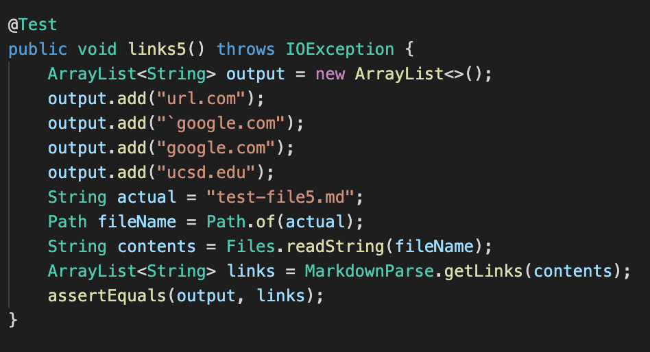
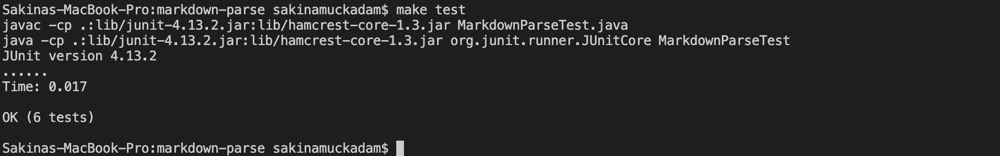
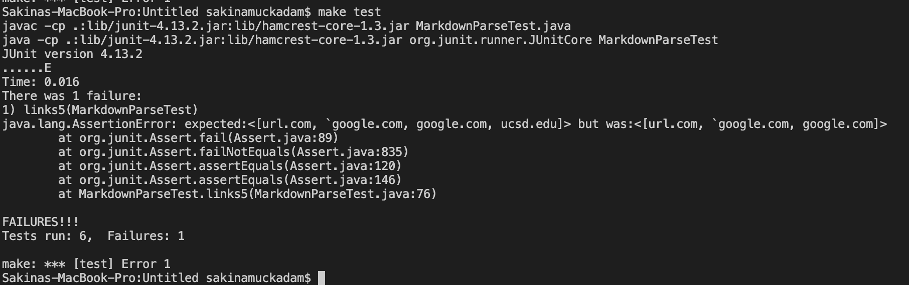
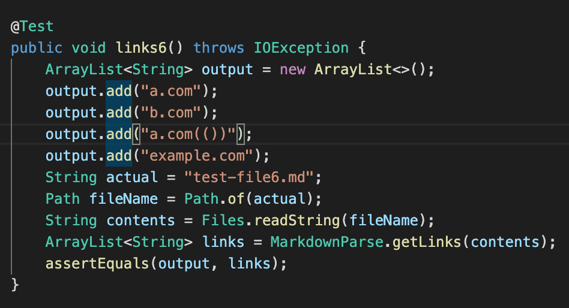
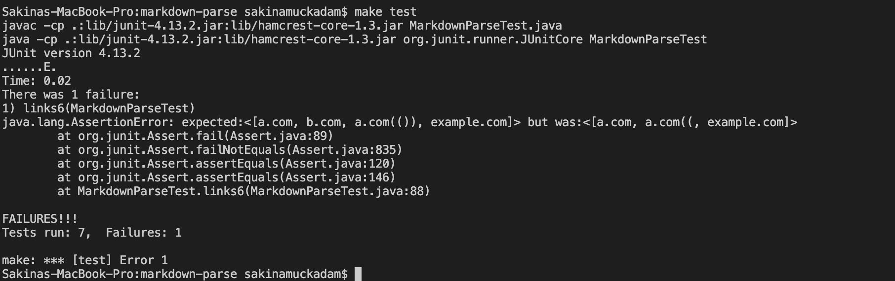
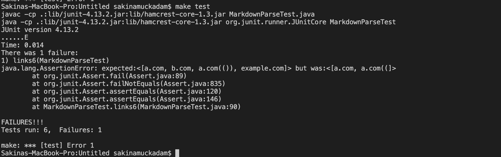
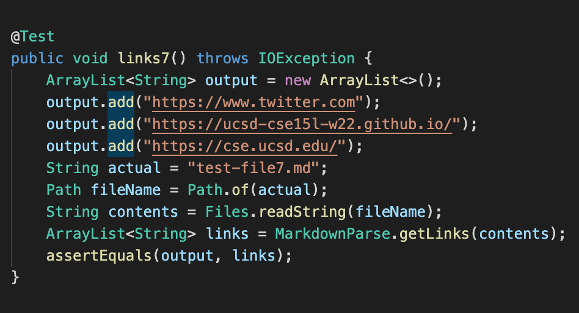
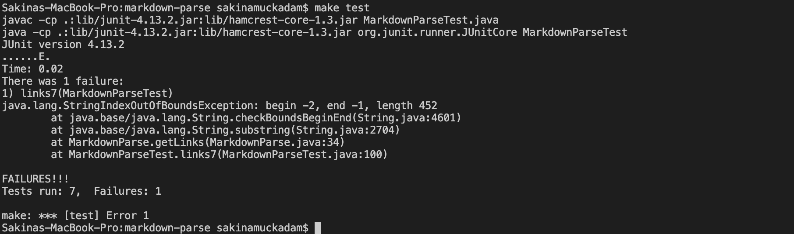
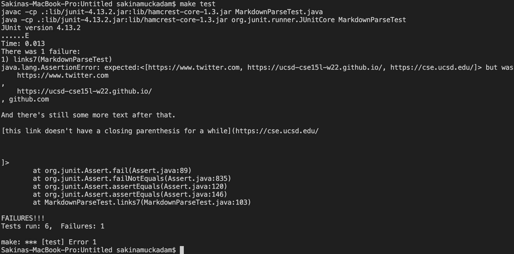

# Hello! Welcome to Lab 4 - All about Debugging

## We are going to be talking about debugging the MarkdownParse files and just some snippets of code that could cause bugs

By Sakina Muckadam (CS Student at UCSD)

---

This week my lab group and I worked on trying to debug the MarkdownParse files.

We reviewed another groups code and I will be writing about both of our codes in this post!

Here is a link to our code:
[Link to our code](https://github.com/sm52/markdown-parse)

And a link to the code we reviewed:
[Link to reviewed code](https://github.com/zhl010/markdown-parse)


### 1) First test case
---

This is our first snippet that we are going to be testing.

```
`[a link`](url.com)

[another link](`google.com)`

[`cod[e`](google.com)

[`code]`](ucsd.edu)
```

**This is what it should produce:**

---

`[a link`](url.com)

[another link](`google.com)`

[`cod[e`](google.com)

[`code]`](ucsd.edu)

---

**The Test**



My results:



As we can see it passes. Yay!

Other group's results:



This one sadly did not pass. :(


### 2) Second Test Case
---

This is our second snippet that we are going to be testing.

```
[a [nested link](a.com)](b.com)

[a nested parenthesized url](a.com(()))

[some escaped \[ brackets \]](example.com)
```

**This is what is should produce:**

---

[a [nested link](a.com)](b.com)

[a nested parenthesized url](a.com(()))

[some escaped \[ brackets \]](example.com)

---

**The Test**



My results:



This one sadly did not pass. :(


Other group's results:



This one sadly did not pass. :(


### 3) Third Test Case
---

This is our third snippet that we are going to be testing.

```
[this title text is really long and takes up more than 
one line

and has some line breaks](
    https://www.twitter.com
)

[this title text is really long and takes up more than 
one line](
    https://ucsd-cse15l-w22.github.io/
)


[this link doesn't have a closing parenthesis](github.com

And there's still some more text after that.

[this link doesn't have a closing parenthesis for a while](https://cse.ucsd.edu/


)

And then there's more text
```

**This is what is should produce:**

---

[this title text is really long and takes up more than 
one line

and has some line breaks](
    https://www.twitter.com
)

[this title text is really long and takes up more than 
one line](
    https://ucsd-cse15l-w22.github.io/
)


[this link doesn't have a closing parenthesis](github.com

And there's still some more text after that.

[this link doesn't have a closing parenthesis for a while](https://cse.ucsd.edu/


)

And then there's more text

---

**The Test**


My results:



This one sadly did not pass. :(

Other group's results:



This one sadly did not pass. :(


### 4) What did we learn?
---

**1) All about backticks:**

I think that our code worked perfectly for the backticks since our test case passed. It took into account the backticks and the brackets which should have printed. I used VSC to get the expected output. 

**2) All about brackets:**

For this test since there were nested brackets and parenthesis I think we should update our counters for both brackets and parens so it can take account the nested stuff. Mostly I think that we need to do more testing to really understand the indices in these cases. It should look for pairs of parenthesis rather than just open and close. This way we know which parenthesis to print and which ones are not part of the link code.

**3) All about new lines:**

For this snippet I do believe that we need to do more in depth testing and debugging. Just looking at our code I couldn't really understand what would be an immediate fix. For this one, my initial thoughts were taking into account again pairs of parenthesis and brackets as well as thinking about somehow incorporating some checks for new lines. Therefore even when spanning multiple lines we would still be able to properly print our links.

---
And there you are folks another step closer to becoming pro-coders.
This was one of the more frustrating processes because you really are just seeing your masterpiece be pulled apart and torn to test in several cases. But I am here to tell you it's all part of the process and just makes your code so much stronger. I know that I am definitely going to be looking at my code files to somehow try to fix these tests and see if I can come to a solution. And remember you can always ask for help, I know I have gone to my TA's multiple times. Don't worry if you have mistakes that's how you learn. Alright ya'll have fun debugging (or don't lol) just remember to breathe and if you have to, take a break and then get back to it. You GOT THIS!!! :)