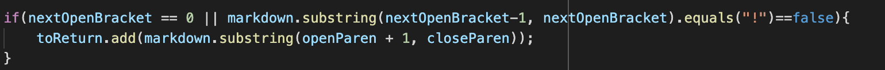

# Hello! Welcome to Lab 4 - Testing lots of files

## We are going to be talking about testing the lots of files and how we can make it easier plus we are going to be doing some compare and contrast with two different programs.

By Sakina Muckadam (CS Student at UCSD)

---

This week my lab group and I worked on trying to test several files in one go. 

We were given about 652 files and we ran the them all at once and printed out the results in one file. 

We did this first with the implementation of Markdown that our professor provided us and then we did this with out own implementation as well. 

Since we wanted to compare the results we used `diff` to compare the two files we generated. 

We used a specific command that compared our results with our professor's results:

```diff results.txt ../markdown-parsePolitz/results.txt```

We got a bunch of different tests but here are just two that we looked at:

### 1) First test case
---

The first test that we got differing results for was test-files/342.md

We got:

```IndexOutOfBoundsException```

The Professor got:

```[/foo`]```

We came to the conclusion that both of these were wrong because of the backticks. 

When looking at our code I think the we could have fixed the problem by including a check for backticks in front if brackets which could have helped in our test case. 

The specific part of the code that might help solve the problem would be



I think that if we changed up the if statement or put in some more if statements to consider the backticks then we could solve the problem. 

### 2) Second Test Case
---

Another test case where we were wrong was test-files/530.md.
In this test there was an image that our code printed but the professor did not print.

We got:
```[moon.jpg]```

The professor got:
```[]```

We think that the professor was correct in this implementation because we don't actually want to print the images we just want to print links.

For this bug we could do something similar but a little different to the solution to the first test. For this one we have to take into account the `!` in the image code. 

We would have to fix something to do with the if statement again just like the first test. 


### 3) What did we learn?
---

We learned about running lots of files and then using ```diff``` to compare it to another file to compare results. In this way we can run tests faster and compare and contrast two different programs. 

---
And there you are folks another step closer to becoming pro-coders.
This time it was pretty complicated but super helpful to become a real life programmer. It's super useful to know how to run a bunch of test files because that's how it is in the real world. They run a bunch of files at once so they can then compare each others work when working in a team. This lab really taught me about teamwork. Alright y'all have a great week and a great time coding! See you next time!!!